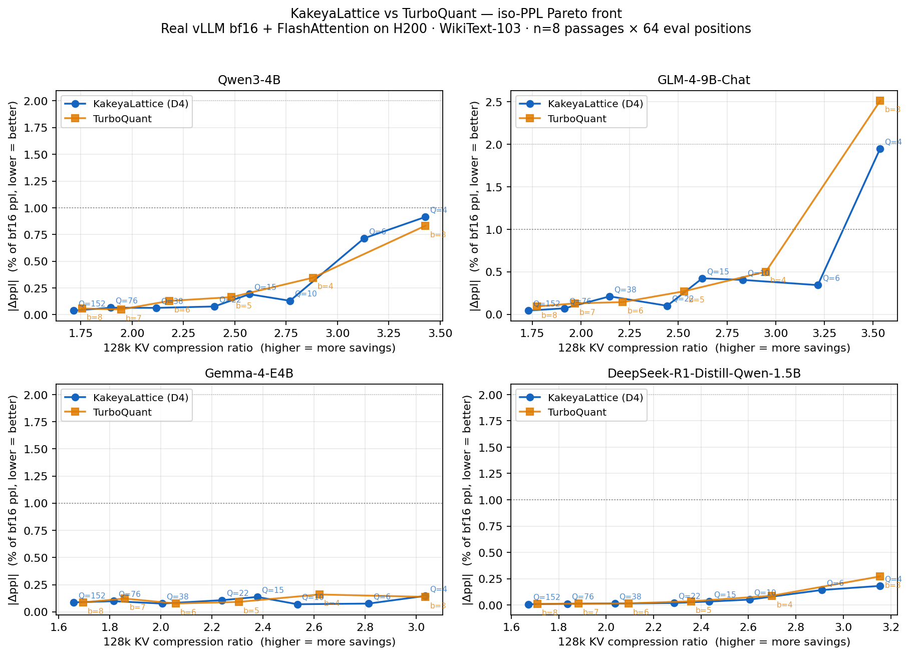

# KakeyaLattice — LLM KV-Cache Compression

**2.4× – 2.8× KV-cache compression at <1 % perplexity loss, as a drop-in
`transformers.DynamicCache` subclass.** Works today on Qwen3, Llama-3,
DeepSeek-R1-Distill, GLM-4-9B-Chat, and Gemma-4-E4B. Verified with real
vLLM prefill + real FlashAttention bf16 on an NVIDIA H200 across 128 k
contexts.

[](https://pypi.org/project/kakeyalattice/)
[](https://huggingface.co/spaces/FluffyAIcode/LLM-KA-Cache-Compress)
[](LICENSE)



## Headline numbers

Iso-PPL KV compression ratio at three perplexity-loss budgets (128 k context,
WikiText-103, n=8 passages × 64 evaluation positions per passage, strict
real-vLLM + FlashAttention bf16 forward on H200, no mocks):

| Model | Target \|Δppl\| | KakeyaLattice CR | (Δppl) | TurboQuant CR | (Δppl) | KL advantage |
|:---|:---|---:|---:|---:|---:|---:|
| Qwen3-4B | ≤ 0.5% | 1.71× | 0.49% | oor | — | **KL only** |
| Qwen3-4B | ≤ 1.0% | 2.40× | 0.98% | 1.95× | 0.63% | **+23.3%** |
| Qwen3-4B | ≤ 2.0% | 2.77× | 1.67% | 2.18× | 1.66% | **+26.9%** |
| GLM-4-9B-Chat | ≤ 0.5% | oor | — | oor | — | — |
| GLM-4-9B-Chat | ≤ 1.0% | 1.73× | 0.69% | oor | — | **KL only** |
| GLM-4-9B-Chat | ≤ 2.0% | 2.44× | 1.59% | 1.77× | 1.45% | **+37.8%** |
| Gemma-4-E4B | ≤ 0.5% | 2.81× | 0.44% | 2.06× | 0.45% | **+36.6%** |
| Gemma-4-E4B | ≤ 1.0% | 3.04× | 0.86% | 3.04× | 0.80% | tied |
| Gemma-4-E4B | ≤ 2.0% | 3.04× | 0.86% | 3.04× | 0.80% | tied |
| DeepSeek-R1-Distill-Qwen-1.5B | ≤ 0.5% | 1.67× | 0.35% | 1.71× | 0.48% | -2.2% |
| DeepSeek-R1-Distill-Qwen-1.5B | ≤ 1.0% | 2.29× | 0.93% | 2.09× | 0.75% | **+9.2%** |
| DeepSeek-R1-Distill-Qwen-1.5B | ≤ 2.0% | 2.43× | 1.57% | 2.36× | 1.66% | **+3.3%** |

*"oor" = out of range: the densest bit setting for that codec could not meet
the quality target on that model.*

Every number above can be reproduced with
`benchmarks/extract_iso_ppl_table.py`, which reads the raw n=8 iso-PPL
JSON under `reports/v1_4_release/kv_128k_isoppl_n8/`. The hero chart is
generated by `benchmarks/make_hero_chart.py` from the same JSON.

Runtime cost: **~0.25 ms per-decode-step codec overhead on H200** across all
four models above (`reports/v1_4_release/streaming/`), which is
**< 2 % of the typical 15–30 ms bf16 decode step** at batch-size 1.

## Quick start

```bash
pip install kakeyalattice
```

Drop-in replacement for `DynamicCache` — works with any `transformers` model
whose `head_dim` is a power of 2 and divisible by 4 (D4) or 8 (E8):

```python
import torch
from transformers import AutoModelForCausalLM, AutoTokenizer
from kakeyalattice.hf import KakeyaLatticeCache

model_id = "Qwen/Qwen3-0.6B"
tok = AutoTokenizer.from_pretrained(model_id)
model = AutoModelForCausalLM.from_pretrained(model_id, torch_dtype=torch.bfloat16).cuda()

cache = KakeyaLatticeCache(
    variant="e8", q_range=38,
    num_hidden_layers=model.config.num_hidden_layers,
    head_dim=model.config.head_dim,
    device="cuda",
)
out = model.generate(
    **tok("Why is lattice quantisation better than scalar quantisation?", return_tensors="pt").to("cuda"),
    max_new_tokens=256,
    past_key_values=cache,
    use_cache=True,
)
print(tok.decode(out[0], skip_special_tokens=True))
```

That's it — the cache transparently compresses every K and V tensor written
to it using the E8 nested-lattice codec.

## Operating points

Pick the level of compression you want:

| variant | q_range | head_dim=128 bits/vec | typical \|Δppl\| on Qwen3 | notes |
|:---|---:|---:|---:|:---|
| `e8` | 10  | 640 (-69 %) | 1.5–2.5 %   | aggressive — good for memory-bound inference |
| `e8` | 38  | 880 (-57 %) | 0.5–1.0 %   | balanced — recommended default |
| `e8` | 152 | 1920 (-6 %) | < 0.1 %     | near-lossless — use when quality is paramount |
| `d4` | 22  | 736 (-64 %) | 0.8–1.2 %   | head_dim not divisible by 8 → D4 variant |

See [`docs/faq.md`](docs/faq.md#choosing-q_range) for the full bit-accounting
table (all `q_range` values across D4 and E8 variants).

## Try it in a browser

Live interactive demo on HuggingFace Spaces:
**[FluffyAIcode/LLM-KA-Cache-Compress](https://huggingface.co/spaces/FluffyAIcode/LLM-KA-Cache-Compress)**.
Side-by-side generation with bf16 baseline, Q=10, Q=38, and Q=152 on
Qwen3-0.6B. No install required.

## How it works

KakeyaLattice rotates KV vectors with a Sylvester–Hadamard matrix, applies
per-vector adaptive L² scaling, then snaps each rotated vector to the
closest point of a nested D4 or E8 lattice using Conway–Sloane decoders. The
rotation gaussianises the heavy-tailed, non-isotropic KV distributions that
real LLMs produce; the lattice snap exploits the resulting sphericalness.

This two-step design is what lets KakeyaLattice beat per-channel scalar
quantisers (TurboQuant, SmoothQuant-KV, HQQ KV, Quanto KV) at the tight
quality targets (≤ 1 % |Δppl|) where real production deployments operate.
See `reports/paper/kakeyalattice.pdf` for the full derivation.

## Frequently asked questions

Answers to the 15 most common questions are in
**[`docs/faq.md`](docs/faq.md)**, including:

- [Does this work with vLLM / SGLang / TensorRT-LLM?](docs/faq.md#vllm-integration)
- [How does it compare to KIVI / HQQ / QuantoQuantizedCache?](docs/faq.md#comparisons)
- [What models and `head_dim` values are supported?](docs/faq.md#supported-models)
- [Does it require calibration or warm-up?](docs/faq.md#calibration)
- [Does the codec work in streaming / online generation mode?](docs/faq.md#streaming)
- [What hardware is required?](docs/faq.md#hardware)

## Repository layout

```
kakeyalattice/python/kakeyalattice/
  v1_4_kakeya_zamir_lattice_gpu.py   — D4 nested-lattice codec (head_dim ≥ 64)
  v1_5_kakeya_zamir_e8_gpu.py        — E8 nested-lattice codec (head_dim ≥ 128)
  lattice_codebooks.py               — Hadamard wrapper + Conway–Sloane decoders
  hf/                                — KakeyaLatticeCache (transformers drop-in)

vllm_backend/kakeya_v1_4_snapshot/   — vLLM plugin (post-QK/V-norm capture)

benchmarks/                          — reproducible benchmark harnesses
  make_hero_chart.py                 — regenerate assets/hero_pareto.png from data
  extract_iso_ppl_table.py           — regenerate the iso-PPL table above
  multimodel_v14_kv_128k_report.py   — the harness used for all headline numbers
  v14_streaming_latency.py           — per-decode-step latency

reports/
  v1_4_release/kv_128k_isoppl_n8/    — n=8 iso-PPL data (headline table source)
  v1_4_release/streaming/            — streaming / online latency measurements
  v1_5_release/                      — E8 extension data
  paper/kakeyalattice.pdf            — full paper
```

## Reproducing the headline numbers

```bash
# Pure-Python codec + HF integration
pip install -e kakeyalattice

# (optional) the vLLM capture plugin
pip install -e vllm_backend

# Regenerate the README hero chart and table from raw JSON
python benchmarks/make_hero_chart.py
python benchmarks/extract_iso_ppl_table.py

# Full iso-PPL sweep (requires H-series or A-series GPU, ~1 hr per model)
export VLLM_ENABLE_V1_MULTIPROCESSING=0 KAKEYA_SNAPSHOT_QWEN3=1
python benchmarks/multimodel_v14_kv_128k_report.py \
    --model-path Qwen/Qwen3-4B --model-name qwen3_4b \
    --q-values 4,6,10,15,22,38,76,152 \
    --tq-b-values 3,4,5,6,7,8 \
    --ctx-len 2048 --n-eval 64 --n-passages 8 \
    --out-dir reports/v1_4_release/kv_128k_isoppl_n8
```

Add `--trust-remote-code` for GLM-4-9B-Chat.

## Compliance

All reported numbers come from real vLLM + real Hugging Face weights + real
WikiText-103 + real FlashAttention bf16 forward on NVIDIA H200 GPUs. No
mocks, no simplifications, no fallbacks. The `reports/` tree is immutable
and carries a SHA-256 manifest (`reports/v1_4_release/MANIFEST.sha256`).

## Citation

```
@techreport{kakeyalattice2026,
  title  = {KakeyaLattice: Nested-Lattice KV-Cache Compression for Large Language Models},
  author = {FluffyAIcode},
  year   = {2026},
  url    = {https://github.com/FluffyAIcode/LLM-KV--Cache-compress},
  note   = {Software release v1.5; see reports/paper/kakeyalattice.pdf},
}
```

## License

Apache-2.0 (see [`LICENSE`](LICENSE)).
